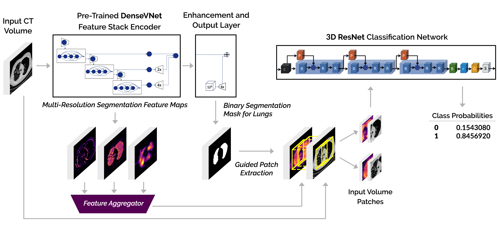
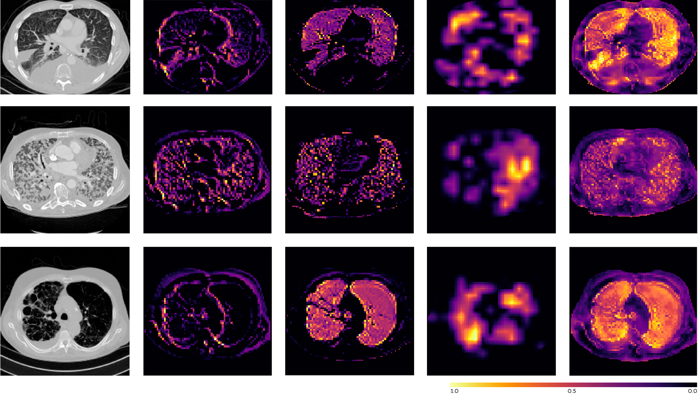
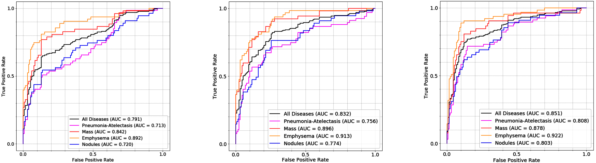

# Deep Segmentation Features in 3D Medical Classifier
**Problem Statement**: Weakly supervised 3D classification of multi-organ, multi-disease CT scans.

**Directories**  
  ● Convert DICOM to NIfTI Volumes: `preprocess/prime/DICOM_NIFTI.py`  
  ● Resample NIfTI Volume Resolutions: `preprocess/prime/resampleRes.py`  
  ● Infer StFA/DyFA Segmentation Sub-Model (DenseVNet): `python net_segment.py inference -c '../config.ini'`  
  ● Preprocess Full Dataset to Optimized I/O HDF5 Training Patch-Volumes: `preprocess/prime/preprocess_alpha.py`  
  ● Preprocess Full Dataset to Optimized I/O HDF5 Deployment Whole-Volumes: `preprocess/prime/preprocess_deploy.py`  
  ● Generate Data-Directory Feeder List: `feed/prime/feed_metadata.py`  
  ● Train StFA Classification Sub-Model: `train/prime/train_StFA.py`  
  ● Train DyFA Classification Sub-Model: `train/prime/train_DyFA.py`  
  ● Deploy Model (Validation): `deploy/prime/deployBinary.py`  
  ● Average Predictions for Same Patient: `deploy/prime/average_predictions.py`  
  ● Calculate AUC: `notebooks/binary_AUC.ipynb`
  

**Publications:**  
  ● A. Saha, F.I. Tushar, K. Faryna, R. Hou, G.D. Rubin, J.Y. Lo (2020), "Weakly Supervised 3D Classification of Chest CT using  
    Aggregated Multi-Resolution Deep Segmentation Features", 2020 SPIE Medical Imaging: Computer-Aided Diagnosis, Houston, TX, USA.
    (*manuscript accepted for oral presentation*)
                 
                 
## Dataset
Class A: Diseased Cases (Pneumonia-Atelectasis, Emphysema, Nodules, Mass)
Class B: Normal Cases

## Network Architecture  
  
  
*Figure 1.  Integrated model architecture for reusing segmentation feature maps in 3D binary classification. The segmentation sub-model is a DenseVNet, taking a variable input volume with a single channel and the classification sub-model is a 3D ResNet, taking an input volume patch of size [112,112,112] with 2 channels. Final output is a tensor with the predicted class probabilities.*  
  
    
    
## Multi-Resolution Deep Segmentation Features  
  
  
*Figure 2.  From left-to-right: input CT volume (axial view), 3 out of 61 segmentation feature maps extracted from the pretrained DenseVNet model, at different resolutions, and their corresponding static aggregated feature maps (StFA) in the case of diseased lungs with atelectasis (top row), mass (middle row) and emphysema (bottom row).*  
  
    
    
## Experimental Results  
  
  
*Figure 3.  ROC curves for each disease class against all normal cases and all disease classes against all normal cases for the independent (left),  StFA (center) and DyFA (right) models for binary lung disease classification.*
